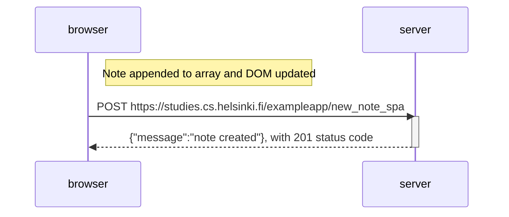

```mermaid
sequenceDiagram
participant browser
participant server

    Note right of browser: Note appended to array and DOM updated
    browser->>server: POST https://studies.cs.helsinki.fi/exampleapp/new_note_spa
    activate server
    server-->>browser: {"message":"note created"}, with 201 status code
    deactivate server
```
